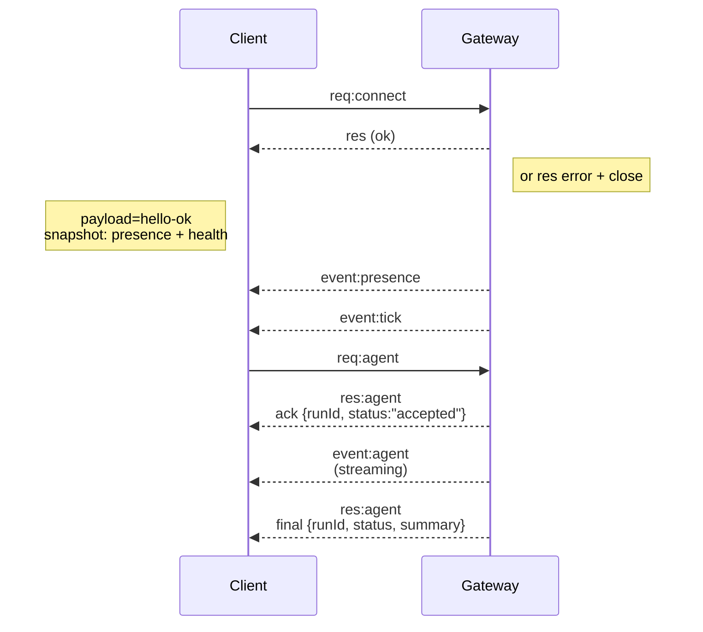

## 概述

- 单个长期存在的 **Gateway** 拥有所有消息传递表面（WhatsApp 通过
  Baileys、Telegram 通过 grammY、Slack、Discord、Signal、iMessage、 WebChat)。
- 控制平面客户端（macOS 应用、CLI、Web UI、自动化）连接到
  Gateway 通过 **WebSocket** 在配置的绑定主机上（默认
  `127.0.0.1:18789`)。
- **节点** (macOS/iOS/Android/headless) 也通过 **WebSocket** 连接，但是
  使用显式能力/命令声明 `role: node` 。
- 每台主机一个 Gateway；它是唯一打开 WhatsApp 会话的地方。
- **画布主机**由 Gateway HTTP 服务器提供服务，位于：
  - `/__openclaw__/canvas/`（智能体可编辑 HTML/CSS/JS）
  - `/__openclaw__/a2ui/`（A2UI 主机）
    它使用与 Gateway 相同的端口（默认为 `18789`）。

## 组件和流程

### Gateway（守护进程）

- 维护提供商连接。
- 公开类型化的 WS API （请求、响应、服务器推送事件）。
- 根据 JSON Schema 验证入站帧。
- 发出 `agent`、`chat`、`presence`、`health`、`heartbeat`、`cron` 等事件。

### 客户端（Mac 应用 / CLI / Web 管理）

- 每个客户端一个 WS 连接。
- 发送请求（`health`、`status`、`send`、`agent`、`system-presence`）。
- 订阅事件（`tick`、`agent`、`presence`、`shutdown`）。

### 节点 (macOS / iOS / Android / headless)

- 使用 `role: node` 连接到 **同一 WS 服务器**。
- 在 `connect` 中提供设备标识；配对是**基于设备**（角色 `node`）并且
  批准存在于设备配对存储中。
- 公开诸如 `canvas.*`、`camera.*`、`screen.record`、`location.get` 之类的命令。

协议详细信息：

- [Gateway 协议](/gateway/protocol)

### WebChat

- 静态 UI 使用 Gateway WS API 进行聊天历史记录并发送。
- 在远程设置中，通过与其他连接相同的 SSH/Tailscale 隧道进行连接
  客户。

## 连接生命周期（单个客户端）



## 线协议（摘要）

- 传输：WebSocket，带有 JSON 有效负载的文本帧。
- 第一帧**必须**是`connect`。
- 握手后：
  - 请求：`{type:"req", id, method, params}` → `{type:"res", id, ok, payload|error}`
  - 事件：`{type:"event", event, payload, seq?, stateVersion?}`
- `hello-ok.features.methods` / `events` 是发现元数据，而不是
  每个可调用辅助路由的生成转储。
- 共享秘密认证使用 `connect.params.auth.token` 或
  `connect.params.auth.password`，取决于配置的网关认证模式。
- 身份承载模式，例如 Tailscale 服务
  (`gateway.auth.allowTailscale: true`) 或非环回
  `gateway.auth.mode: "trusted-proxy"` 满足请求标头的认证
  而不是 `connect.params.auth.*`。
- Private-ingress `gateway.auth.mode: "none"` 禁用共享秘密认证
  完全；保持该模式远离公共/不受信任的入口。
- 副作用方法（`send`、`agent`）需要幂等键
  安全地重试；服务器保留短暂的重复数据删除缓存。
- 节点必须包含 `role: "node"` 以及 `connect` 中的能力/命令/权限。

## 配对+本地信任

- 所有 WS 客户端（操作员 + 节点）均包含 `connect` 上的 **设备标识**。
- 新设备 ID 需要配对批准； Gateway 发出 **设备token**
  用于后续连接。
- 可以自动批准直接 local loopback 连接以保持同一主机的用户体验
  光滑。
- OpenClaw 还具有狭窄的后端/容器本地自连接路径
  受信任的共享秘密帮助程序流。
- Tailnet 和 LAN 连接，包括同一主机 tailnet 绑定，仍然需要
  明确的配对批准。
- 所有连接都必须签署 `connect.challenge` 随机数。
- 签名有效负载 `v3` 还绑定 `platform` + `deviceFamily`；网关
  重新连接时固定配对元数据，并需要修复元数据配对
  变化。
- **非本地**连接仍然需要明确批准。
- Gateway auth (`gateway.auth.*`) 仍然适用于**所有**连接，本地或
  远程。

详细信息：[Gateway 协议](/gateway/protocol)、[配对](/channels/pairing)、
[安全](/gateway/security)。

## 协议类型和代码生成

- TypeBox 模式定义协议。
- JSON Schema 是从这些模式生成的。
- Swift 模型是从 JSON Schema 生成的。

## 远程访问

- 首选：Tailscale 或 VPN。
- 替代方案：SSH 隧道

  ```bash
  ssh -N -L 18789:127.0.0.1:18789 user@host
  ```

- 相同的握手+认证token适用于隧道。
- TLS + 可以在远程设置中为 WS 启用可选固定。

## 操作快照

- 开始：`openclaw gateway`（前台，记录到标准输出）。
- 健康状况：`health` 超过 WS（也包含在 `hello-ok` 中）。
- 监督：launchd/systemd 用于自动重启。

## 不变量

- 每个主机上只有一个 Gateway 控制一个 Baileys 会话。
- 握手是强制性的；任何非 JSON 或非连接第一帧都是硬关闭。
- 事件不会重播；客户必须刷新空白。

## 相关

- [Agent Loop](/concepts/agent-loop) — 详细的智能体执行周期
- [Gateway 协议](/gateway/protocol) — WebSocket 协议合约
- [Queue](/concepts/queue) — 命令队列和并发
- [安全](/gateway/security) — 信任模型和强化
