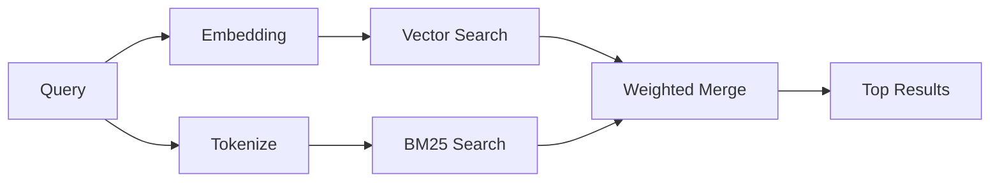

`memory_search` 从内存文件中查找相关注释，即使
措辞与原文不同。它的工作原理是将内存索引成小的
块并使用嵌入、关键字或两者来搜索它们。

## 快速开始

如果你有 GitHub Copilot 订阅、OpenAI、Gemini、Voyage 或 Mistral
API 键已配置，内存搜索自动工作。设置提供商
明确地：

```json5
{
  agents: {
    defaults: {
      memorySearch: {
        provider: "openai", // or "gemini", "local", "ollama", etc.
      },
    },
  },
}
```

对于多端点设置，`provider` 也可以是自定义的
当该提供商设置时，`models.providers.<id>` 条目，例如 `ollama-5080`
`api: "ollama"` 或其他嵌入适配器所有者。

对于没有 API 键的本地嵌入，请设置 `provider: "local"`。包装好的
安装在 OpenClaw 的托管插件中保留本机 `node-llama-cpp` 运行时
运行时依赖树；如果该树需要修复，请运行 `openclaw doctor --fix` 。

一些 OpenAI 兼容的嵌入端点需要非对称标签，例如
`input_type: "query"` 用于搜索，`input_type: "document"` 或 `"passage"`
对于索引块。使用 `memorySearch.queryInputType` 配置它们并
`memorySearch.documentInputType`；请参阅[内存配置参考](/reference/memory-config#provider-specific-config)。

## 支持的提供商

| 供应商        | 身份证           | 需要 API 密钥 | 笔记                        |
| ------------- | ---------------- | ------------- | --------------------------- |
| 基岩          | `bedrock`        | 没有          | 当 AWS 凭证链解析时自动检测 |
| Gemini        | `gemini`         | 是的          | 支持图像/音频索引           |
| GitHub 副驾驶 | `github-copilot` | 没有          | 自动检测，使用 Copilot 订阅 |
| 本地          | `local`          | 没有          | GGUF 模型，~0.6 GB 下载     |
| 米斯特拉尔    | `mistral`        | 是的          | 自动检测                    |
| Ollama        | `ollama`         | 没有          | 本地，必须显式设置          |
| OpenAI        | `openai`         | 是的          | 自动检测，快速              |
| 航程          | `voyage`         | 是的          | 自动检测                    |

## 搜索的工作原理

OpenClaw 并行运行两个检索路径并合并结果：



- **矢量搜索** 查找具有相似含义的注释（“网关主机”匹配
  “运行 OpenClaw 的机器”）。
- **BM25 关键字搜索** 找到完全匹配的内容（ID、错误字符串、配置
  键）。

如果只有一条路径可用（没有嵌入或没有 FTS），则另一条路径单独运行。

当嵌入不可用时， OpenClaw 仍对 FTS 结果使用词法排名，而不是仅退回到原始精确匹配排序。这种降级模式通过更强的查询项覆盖率和相关文件路径来增强块，即使没有 `sqlite-vec` 或嵌入提供商，这也使召回保持有用。

## 提高搜索质量

当你拥有大量笔记历史记录时，两个可选功能会有所帮助：

### 时间衰变

旧笔记逐渐失去排名权重，因此最近的信息首先出现。
默认半衰期为 30 天，上个月的笔记得分为 50%
它的原始重量。像 `MEMORY.md` 这样的常青文件永远不会腐烂。

<Tip>
如果你的智能体有数月的每日笔记并且陈旧，请启用时间衰减
信息的重要性始终高于最近的背景。
</Tip>

### MMR（多样性）

减少冗余结果。如果五个注释都提到相同的路由器配置，MMR
确保顶部结果涵盖不同主题而不是重复。

<Tip>
如果 `memory_search` 不断返回接近重复的片段，则启用 MMR
不同的日常笔记。
</Tip>

### 启用两者

```json5
{
  agents: {
    defaults: {
      memorySearch: {
        query: {
          hybrid: {
            mmr: { enabled: true },
            temporalDecay: { enabled: true },
          },
        },
      },
    },
  },
}
```

## 多模态记忆

使用 Gemini Embedding 2，你可以将图像和音频文件与
Markdown。搜索查询仍然是文本，但它们与视觉和音频相匹配
内容。请参阅[内存配置参考](/reference/memory-config)
设置。

## 会话内存搜索

你可以选择索引会话记录，以便 `memory_search` 可以回忆起来
早些时候的谈话。这是选择加入的方式
`memorySearch.experimental.sessionMemory`。请参阅
详细信息请参考[配置参考](/reference/memory-config)。

## 故障排除

**没有结果？** 运行 `openclaw memory status` 检查索引。如果为空，则运行
`openclaw memory index --force`。

**仅关键字匹配？** 你的嵌入提供商可能未配置。检查
`openclaw memory status --deep`。

**本地嵌入超时？** `ollama`、`lmstudio` 和 `local` 使用更长的时间
默认情况下内联批处理超时。如果主机速度很慢，请设置
`agents.defaults.memorySearch.sync.embeddingBatchTimeoutSeconds` 并重新运行
`openclaw memory index --force`。

**CJK 未找到文本？** 使用以下命令重建 FTS 索引
`openclaw memory index --force`。

## 进一步阅读

- [Active Memory](/concepts/active-memory) -- 用于交互式聊天会话的子智能体内存
- [Memory](/concepts/memory) -- 文件布局、后端、工具
- [内存配置参考](/reference/memory-config) -- 所有配置旋钮

## 相关

- [内存概述](/concepts/memory)
- [活动内存](/concepts/active-memory)
- [内置内存引擎](/concepts/memory-builtin)
