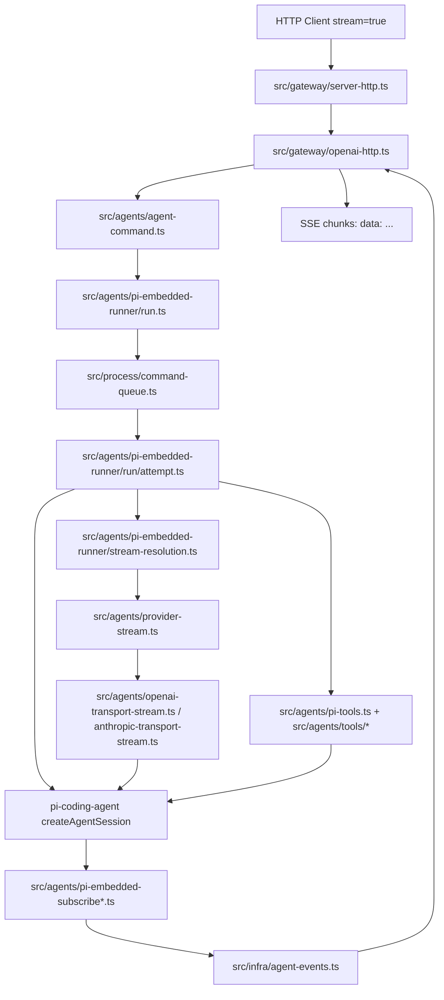

# OpenClaw 用户请求到 SSE 响应的消息流转实现路线

本文用于从源码角度梳理一条典型请求链路：

用户发消息 -> HTTP/SSE 入口 -> 消息进入 Agent -> Agent 调用模型 -> 模型返回流式响应 -> SSE 转发给调用方。

重点目录：

- `src/gateway/`：传输层，HTTP/SSE/WS/RPC Gateway 入口。
- `src/agents/`：代理核心层，Agent 命令编排、会话、模型 attempt、工具订阅。
- `src/agents/tools/` 与 `src/agents/pi-tools.ts`：工具层，工具注册、执行、Gateway 工具调用。
- `src/agents/*transport-stream.ts`、`src/agents/provider-stream.ts`：模型层，provider/model transport 接入。
- `src/process/command-queue.ts`：运行队列层，session/global lane 串行化执行。

## 目录结构速览

```text
src/gateway/
  server-http.ts              HTTP 总入口，分发 /v1/chat/completions、/v1/responses、/tools/invoke
  openai-http.ts              OpenAI chat completions 兼容接口，包含 SSE 输出
  openresponses-http.ts       OpenResponses 兼容接口，包含 SSE 输出
  server-chat.ts              Gateway/Control UI 的 agent/chat 事件广播，偏 WS 与 UI
  http-common.ts              SSE header、JSON 响应等 HTTP 公共工具

src/agents/
  agent-command.ts            Agent 命令入口，ingress 安全边界，模型 fallback 外层编排
  pi-embedded-runner/run.ts   Agent run 队列、provider/model 解析、attempt 调度
  pi-embedded-runner/run/attempt.ts
                              单次模型 attempt：会话、工具、streamFn、订阅处理
  pi-embedded-subscribe*.ts   把模型/工具事件转成 OpenClaw agent events
  pi-tools.ts                 内置工具组装
  tools/                      gateway、cron、image 等具体工具
  openai-transport-stream.ts  OpenAI Responses / Chat Completions 流式 transport
  anthropic-transport-stream.ts
                              Anthropic Messages 流式 transport
  provider-stream.ts          provider-owned streamFn 与内置 transport 选择
  provider-transport-stream.ts
                              按 model.api 分发到具体 transport stream

src/process/
  command-queue.ts            lane 队列实现
```

## 模块关系依赖图



## 完整消息流转链路

### 1. HTTP/SSE 入口

入口文件：`src/gateway/server-http.ts`

核心方法：

- `isOpenAiChatCompletionsPath()`：识别 `/v1/chat/completions`。
- `isOpenResponsesPath()`：识别 `/v1/responses`。
- request stage 分发逻辑：按 path 将请求交给对应 HTTP handler。

关键位置：

- `src/gateway/server-http.ts:233`：识别 `/v1/chat/completions`。
- `src/gateway/server-http.ts:237`：识别 `/v1/responses`。
- `src/gateway/server-http.ts:987`：将 OpenAI 兼容请求交给 `handleOpenAiHttpRequest()`。

OpenAI 兼容接口文件：`src/gateway/openai-http.ts`

核心方法：

- `handleOpenAiHttpRequest()`：处理 OpenAI Chat Completions 兼容请求。
- `writeSse()`：写出 SSE `data: ...\n\n`。
- `buildAgentCommandInput()`：将 HTTP payload 转成 Agent 命令输入。
- `writeAssistantRoleChunk()`：写 assistant role chunk。
- `writeAssistantContentChunk()`：写 assistant delta chunk。
- `writeAssistantStopChunk()`：写 stop chunk。
- `writeDone()`：写 `[DONE]`。

关键位置：

- `src/gateway/openai-http.ts:111`：`writeSse()`。
- `src/gateway/openai-http.ts:116`：`buildAgentCommandInput()`。
- `src/gateway/openai-http.ts:506`：`handleOpenAiHttpRequest()` 入口。
- `src/gateway/openai-http.ts:528`：读取 `payload.stream`。
- `src/gateway/openai-http.ts:677`：订阅 `onAgentEvent()`。
- `src/gateway/openai-http.ts:685`：接收 `stream === "assistant"` 并写 SSE content chunk。
- `src/gateway/openai-http.ts:706`：接收 lifecycle `end/error` 并触发收尾。

### 2. 消息进入 Agent

入口文件：`src/agents/agent-command.ts`

核心方法：

- `agentCommandFromIngress()`：网络入口专用 Agent 命令入口。
- `agentCommand()`：本地 CLI/可信入口。
- `agentCommandInternal()`：Agent 命令主编排。
- `runWithModelFallback()` 调用块：处理模型 fallback 后再进入 attempt。

关键位置：

- `src/agents/agent-command.ts:1110`：`agentCommandFromIngress()`。
- `src/agents/agent-command.ts:880`：调用 `attemptExecutionRuntime.runAgentAttempt()`。
- `src/agents/agent-command.ts:930` 附近：成功后发 lifecycle `end`。
- `src/agents/agent-command.ts:1020` 附近：失败后发 lifecycle `error`。

注意点：

- `agentCommandFromIngress()` 要求显式传入 `senderIsOwner`。
- `agentCommandFromIngress()` 要求显式传入 `allowModelOverride`。
- 这是 HTTP/WS 网络入口和本地可信 CLI 入口的安全分界。

### 3. Agent 运行队列

入口文件：`src/agents/pi-embedded-runner/run.ts`

核心方法：

- `runEmbeddedPiAgent()`：嵌入式 Agent run 主入口。
- `resolveSessionLane()`：按 session 解析队列 lane。
- `resolveGlobalLane()`：解析全局队列 lane。
- `enqueueCommandInLane()`：入队执行。

关键位置：

- `src/agents/pi-embedded-runner/run.ts:204`：`runEmbeddedPiAgent()`。
- `src/agents/pi-embedded-runner/run.ts:219`：解析 session lane 与 global lane。
- `src/agents/pi-embedded-runner/run.ts:252`：先入 session lane，再入 global lane。

队列实现文件：`src/process/command-queue.ts`

核心方法：

- `enqueueCommandInLane()`：将任务放入 lane 队列。
- `drainLane()`：执行队列任务。
- `setCommandLaneConcurrency()`：设置 lane 并发。
- `clearCommandLane()`：清空 lane。

关键位置：

- `src/process/command-queue.ts:31`：队列状态结构。
- `src/process/command-queue.ts:155`：`drainLane()`。
- `src/process/command-queue.ts:242`：`enqueueCommandInLane()`。

队列语义：

- session lane：保证同一个 session 的消息顺序。
- global lane：控制全局运行并发，避免多个 Agent run 互相打乱关键资源。
- `runEmbeddedPiAgent()` 采用 session lane 包 global lane 的结构。

### 4. 单次模型 attempt

入口文件：`src/agents/pi-embedded-runner/run/attempt.ts`

核心方法：

- `runEmbeddedAttempt()`：单次模型 attempt 主体。
- `createOpenClawCodingTools()`：组装工具。
- `createEmbeddedAgentSessionWithResourceLoader()`：创建 `pi-coding-agent` session。
- `resolveEmbeddedAgentStreamFn()`：解析最终模型 streamFn。
- `subscribeEmbeddedPiSession()`：订阅模型/工具事件并转成 OpenClaw 事件。
- `setActiveEmbeddedRun()`：登记活跃 run，支持后续消息排队。

关键位置：

- `src/agents/pi-embedded-runner/run/attempt.ts:1112`：创建 Agent session。
- `src/agents/pi-embedded-runner/run/attempt.ts:1237`：设置 `activeSession.agent.streamFn`。
- `src/agents/pi-embedded-runner/run/attempt.ts:1657`：调用 `subscribeEmbeddedPiSession()`。
- `src/agents/pi-embedded-runner/run/attempt.ts:1732`：调用 `setActiveEmbeddedRun()`。

活跃 run 管理文件：`src/agents/pi-embedded-runner/runs.ts`

核心方法：

- `setActiveEmbeddedRun()`：登记当前 session 的活跃 run。
- `queueEmbeddedPiMessage()`：如果 run 正在 streaming，则把追加消息投递给活跃 run。
- `abortEmbeddedPiRun()`：中止 run。

关键位置：

- `src/agents/pi-embedded-runner/runs.ts:99`：`queueEmbeddedPiMessage()`。
- `src/agents/pi-embedded-runner/runs.ts:353`：`setActiveEmbeddedRun()`。

### 5. 工具层

工具组装文件：`src/agents/pi-tools.ts`

核心方法：

- `createOpenClawCodingTools()`：创建本次 Agent run 可用的工具集合。
- `createLazyExecTool()`：懒加载 exec 工具。
- `createLazyProcessTool()`：懒加载 process 工具。

关键位置：

- `src/agents/pi-tools.ts:258`：`createOpenClawCodingTools()`。
- `src/agents/pi-tools.ts:453`：接入 `pi-coding-agent` 基础工具。
- `src/agents/pi-tools.ts:497`：创建 exec 工具。
- `src/agents/pi-tools.ts:582`：合入 OpenClaw 自有工具。

工具执行包装文件：`src/agents/pi-tool-definition-adapter.ts`

核心方法：

- `toClientToolDefinitions()`：把工具定义适配成模型/provider 可消费的格式。
- 包装后的 `execute()`：在工具执行前后补充事件、错误、结果规范化。

关键位置：

- `src/agents/pi-tool-definition-adapter.ts:226`：包装工具执行。
- `src/agents/pi-tool-definition-adapter.ts:324`：另一条工具执行适配路径。

工具事件订阅文件：`src/agents/pi-embedded-subscribe.handlers.tools.ts`

核心方法：

- `handleToolExecutionStart()`：工具开始事件。
- `handleToolExecutionUpdate()`：工具执行中事件。
- `handleToolExecutionEnd()`：工具结束事件。

关键位置：

- `src/agents/pi-embedded-subscribe.handlers.tools.ts:556`：`handleToolExecutionStart()`。
- `src/agents/pi-embedded-subscribe.handlers.tools.ts:701`：`handleToolExecutionUpdate()`。
- `src/agents/pi-embedded-subscribe.handlers.tools.ts:779`：`handleToolExecutionEnd()`。
- `src/agents/pi-embedded-subscribe.handlers.tools.ts:606`、`:713`、`:882`：发出 `stream: "tool"` 事件。

Gateway 工具文件：

- `src/agents/tools/gateway.ts`：`callGatewayTool()`，Agent 工具调用 Gateway RPC 的底层封装。
- `src/agents/tools/gateway-tool.ts`：`createGatewayTool()`，暴露给模型的 `gateway` 工具。
- `src/agents/tools/cron-tool.ts`：`createCronTool()`，cron 工具。

### 6. 模型层

streamFn 解析文件：`src/agents/pi-embedded-runner/stream-resolution.ts`

核心方法：

- `resolveEmbeddedAgentBaseStreamFn()`：读取 session 原始 streamFn。
- `resolveEmbeddedAgentStreamFn()`：确定最终 streamFn。
- `describeEmbeddedAgentStreamStrategy()`：描述当前 stream 策略。

关键位置：

- `src/agents/pi-embedded-runner/stream-resolution.ts:12`：`resolveEmbeddedAgentBaseStreamFn()`。
- `src/agents/pi-embedded-runner/stream-resolution.ts:64`：`resolveEmbeddedAgentStreamFn()`。

provider stream 入口：`src/agents/provider-stream.ts`

核心方法：

- `registerProviderStreamForModel()`：优先 provider plugin streamFn，否则走内置 transport。

关键位置：

- `src/agents/provider-stream.ts:8`：`registerProviderStreamForModel()`。

transport 分发文件：`src/agents/provider-transport-stream.ts`

核心方法：

- `createTransportAwareStreamFnForModel()`：按 model/api 选择 transport。
- `createSupportedTransportStreamFn()`：实际 switch 分发。

关键位置：

- `src/agents/provider-transport-stream.ts:82`：OpenAI Responses。
- `src/agents/provider-transport-stream.ts:84`：OpenAI Chat Completions。
- `src/agents/provider-transport-stream.ts:88`：Anthropic Messages。

OpenAI transport 文件：`src/agents/openai-transport-stream.ts`

核心方法：

- `createOpenAIResponsesTransportStreamFn()`：OpenAI Responses 流式调用。
- `createOpenAICompletionsTransportStreamFn()`：OpenAI Chat Completions 流式调用。
- `processResponsesStream()`：解析 Responses 流。
- `processOpenAICompletionsStream()`：解析 Chat Completions 流。

关键位置：

- `src/agents/openai-transport-stream.ts:370`：`processResponsesStream()`。
- `src/agents/openai-transport-stream.ts:652`：`createOpenAIResponsesTransportStreamFn()`。
- `src/agents/openai-transport-stream.ts:977`：`createOpenAICompletionsTransportStreamFn()`。
- `src/agents/openai-transport-stream.ts:1032`：`processOpenAICompletionsStream()`。

Anthropic transport 文件：`src/agents/anthropic-transport-stream.ts`

核心方法：

- `createAnthropicMessagesTransportStreamFn()`：Anthropic Messages 流式调用。
- `convertAnthropicMessages()`：转 Anthropic message payload。
- `convertAnthropicTools()`：转 Anthropic tool payload。

关键位置：

- `src/agents/anthropic-transport-stream.ts:394`：`convertAnthropicTools()`。
- `src/agents/anthropic-transport-stream.ts:739`：`createAnthropicMessagesTransportStreamFn()`。

### 7. 模型/工具事件回流

订阅入口：`src/agents/pi-embedded-subscribe.ts`

核心方法：

- `subscribeEmbeddedPiSession()`：订阅 session 事件，维护 assistant text、tool meta、usage 等状态。
- `rememberAssistantText()`：记录 assistant 输出。
- `emitToolSummary()` / `emitToolOutput()`：工具输出转可投递消息。

关键位置：

- `src/agents/pi-embedded-subscribe.ts:69`：`subscribeEmbeddedPiSession()`。
- `src/agents/pi-embedded-subscribe.ts:249`：记录 assistant text。
- `src/agents/pi-embedded-subscribe.ts:674`：发出 lifecycle 事件。

消息事件处理文件：`src/agents/pi-embedded-subscribe.handlers.messages.ts`

核心方法：

- `handleMessageStart()`：assistant message 开始。
- `handleMessageUpdate()`：assistant message delta/update。
- `handleMessageEnd()`：assistant message 结束。

关键位置：

- `src/agents/pi-embedded-subscribe.handlers.messages.ts:258`：`handleMessageStart()`。
- `src/agents/pi-embedded-subscribe.handlers.messages.ts:277`：`handleMessageUpdate()`。
- `src/agents/pi-embedded-subscribe.handlers.messages.ts:504`：`handleMessageEnd()`。
- `src/agents/pi-embedded-subscribe.handlers.messages.ts:463`、`:588`：发出 assistant 相关事件。

lifecycle 文件：`src/agents/pi-embedded-subscribe.handlers.lifecycle.ts`

核心方法：

- `handleAgentStart()`：Agent run 开始。
- `handleAgentEnd()`：Agent run 结束。

关键位置：

- `src/agents/pi-embedded-subscribe.handlers.lifecycle.ts:23`：`handleAgentStart()`。
- `src/agents/pi-embedded-subscribe.handlers.lifecycle.ts:39`：`handleAgentEnd()`。

事件总线文件：`src/infra/agent-events.ts`

核心方法：

- `emitAgentEvent()`：给事件补 `seq`、`ts`、`sessionKey` 并通知监听者。
- `onAgentEvent()`：订阅事件。
- `emitAgentItemEvent()` / `emitAgentPlanEvent()` / `emitAgentApprovalEvent()`：特定事件 helper。

关键位置：

- `src/infra/agent-events.ts:99`：`AgentEventPayload`。
- `src/infra/agent-events.ts:200`：`emitAgentEvent()`。
- `src/infra/agent-events.ts:286`：`onAgentEvent()`。

### 8. SSE 转发回调用方

回到 `src/gateway/openai-http.ts`：

- `onAgentEvent()` 监听当前 `runId`。
- assistant 事件转 OpenAI `chat.completion.chunk`。
- lifecycle `end/error` 触发 stop chunk、usage chunk、`[DONE]`。

核心逻辑：

```text
Agent emits:
  { runId, stream: "assistant", data: { text/delta } }

openai-http receives:
  onAgentEvent(evt)

openai-http writes:
  data: {"object":"chat.completion.chunk","choices":[{"delta":{"content":"..."}}]}

Agent emits:
  { runId, stream: "lifecycle", data: { phase: "end" } }

openai-http writes:
  stop chunk
  optional usage chunk
  data: [DONE]
```

## 核心类和方法清单

| 层级 | 文件 | 核心方法/对象 | 作用 |
| --- | --- | --- | --- |
| HTTP 入口 | `src/gateway/server-http.ts` | `isOpenAiChatCompletionsPath()` | 识别 `/v1/chat/completions` |
| HTTP 入口 | `src/gateway/server-http.ts` | request stages | 将请求分发给 OpenAI/OpenResponses/tools handler |
| SSE | `src/gateway/openai-http.ts` | `handleOpenAiHttpRequest()` | OpenAI Chat Completions 兼容主入口 |
| SSE | `src/gateway/openai-http.ts` | `writeSse()` | 写 SSE 帧 |
| SSE | `src/gateway/openai-http.ts` | `writeAssistantContentChunk()` | 写 assistant delta |
| SSE | `src/gateway/openai-http.ts` | `onAgentEvent()` callback | 监听 Agent 事件并转 SSE |
| Agent 入口 | `src/agents/agent-command.ts` | `agentCommandFromIngress()` | 网络入口 Agent 命令边界 |
| Agent 编排 | `src/agents/agent-command.ts` | `agentCommandInternal()` | 准备 Agent run、fallback、lifecycle |
| Agent 编排 | `src/agents/agent-command.ts` | `runWithModelFallback()` 调用块 | provider/model fallback 外层 |
| 队列 | `src/agents/pi-embedded-runner/run.ts` | `runEmbeddedPiAgent()` | Agent run 主入口 |
| 队列 | `src/process/command-queue.ts` | `enqueueCommandInLane()` | 入队 |
| 队列 | `src/process/command-queue.ts` | `drainLane()` | 出队并执行 |
| Attempt | `src/agents/pi-embedded-runner/run/attempt.ts` | `runEmbeddedAttempt()` | 单次模型 attempt 主体 |
| Attempt | `src/agents/pi-embedded-runner/run/attempt.ts` | `createEmbeddedAgentSessionWithResourceLoader()` | 创建 Agent session |
| Attempt | `src/agents/pi-embedded-runner/run/attempt.ts` | `resolveEmbeddedAgentStreamFn()` | 解析模型 streamFn |
| Attempt | `src/agents/pi-embedded-runner/run/attempt.ts` | `subscribeEmbeddedPiSession()` | 订阅模型/工具事件 |
| 工具 | `src/agents/pi-tools.ts` | `createOpenClawCodingTools()` | 组装工具集合 |
| 工具 | `src/agents/pi-tool-definition-adapter.ts` | wrapped `execute()` | 工具执行适配 |
| 工具事件 | `src/agents/pi-embedded-subscribe.handlers.tools.ts` | `handleToolExecutionStart()` | 工具开始事件 |
| 工具事件 | `src/agents/pi-embedded-subscribe.handlers.tools.ts` | `handleToolExecutionEnd()` | 工具结束事件 |
| 模型 | `src/agents/provider-stream.ts` | `registerProviderStreamForModel()` | provider stream 入口 |
| 模型 | `src/agents/provider-transport-stream.ts` | `createTransportAwareStreamFnForModel()` | 按 model.api 选择 transport |
| 模型 | `src/agents/openai-transport-stream.ts` | `createOpenAIResponsesTransportStreamFn()` | OpenAI Responses transport |
| 模型 | `src/agents/openai-transport-stream.ts` | `createOpenAICompletionsTransportStreamFn()` | OpenAI Chat Completions transport |
| 模型 | `src/agents/anthropic-transport-stream.ts` | `createAnthropicMessagesTransportStreamFn()` | Anthropic Messages transport |
| 事件 | `src/agents/pi-embedded-subscribe.ts` | `subscribeEmbeddedPiSession()` | session 事件转 OpenClaw 事件 |
| 事件 | `src/infra/agent-events.ts` | `emitAgentEvent()` | 事件总线 emit |
| 事件 | `src/infra/agent-events.ts` | `onAgentEvent()` | 事件总线 subscribe |

## 实操排查路线

### 路线 A：先确认 SSE 是否建立

看 `src/gateway/openai-http.ts`：

1. `handleOpenAiHttpRequest()` 是否命中。
2. `stream` 是否为 `true`。
3. 是否调用 `setSseHeaders(res)`。
4. `writeAssistantRoleChunk()` 是否写出。
5. `writeDone()` 是否最终写出。

如果 SSE 没有任何输出，优先查：

- `runId` 是否一致。
- `onAgentEvent()` 是否收到当前 `runId` 的事件。
- `agentCommandFromIngress()` 是否抛错。

### 路线 B：确认消息是否进入 Agent

看 `src/agents/agent-command.ts`：

1. `agentCommandFromIngress()` 是否被调用。
2. `senderIsOwner` 和 `allowModelOverride` 是否显式传入。
3. `agentCommandInternal()` 是否生成正确 `sessionKey`、`runId`。
4. `runWithModelFallback()` 是否进入 `runAgentAttempt()`。

### 路线 C：确认队列是否阻塞

看：

- `src/agents/pi-embedded-runner/run.ts:204`
- `src/process/command-queue.ts:242`

检查点：

1. session lane 是什么。
2. global lane 是什么。
3. lane 里是否已有长任务。
4. `drainLane()` 是否实际执行 task。

### 路线 D：确认模型是否被调用

看：

- `src/agents/pi-embedded-runner/run/attempt.ts`
- `src/agents/pi-embedded-runner/stream-resolution.ts`
- `src/agents/provider-stream.ts`
- `src/agents/provider-transport-stream.ts`
- `src/agents/openai-transport-stream.ts`
- `src/agents/anthropic-transport-stream.ts`

检查点：

1. `createAgentSession()` 是否成功。
2. `activeSession.agent.streamFn` 最终是哪一个。
3. 当前 `model.api` 是 `openai-responses`、`openai-completions` 还是 `anthropic-messages`。
4. 对应 transport 是否开始 `stream.push(...)`。

### 路线 E：确认工具调用是否正常

看：

- `src/agents/pi-tools.ts`
- `src/agents/pi-tool-definition-adapter.ts`
- `src/agents/pi-embedded-subscribe.handlers.tools.ts`

检查点：

1. 工具是否进入 `createOpenClawCodingTools()` 返回列表。
2. provider 是否支持工具：`supportsModelTools()`。
3. 工具 schema 是否被 `normalizeProviderToolSchemas()` 改写。
4. 工具执行是否进入 wrapped `execute()`。
5. 是否发出 `stream: "tool"` start/update/end 事件。

### 路线 F：确认模型 delta 是否回到 SSE

看：

- `src/agents/pi-embedded-subscribe.handlers.messages.ts`
- `src/infra/agent-events.ts`
- `src/gateway/openai-http.ts`

检查点：

1. `handleMessageUpdate()` 是否收到模型 delta。
2. `emitAgentEvent()` 是否发出 `stream: "assistant"`。
3. `onAgentEvent()` 是否监听到同一个 `runId`。
4. `writeAssistantContentChunk()` 是否写 SSE。
5. lifecycle `end/error` 是否发出。

## 一句话总链路

```text
server-http.ts
  -> openai-http.ts handleOpenAiHttpRequest()
  -> agent-command.ts agentCommandFromIngress()
  -> pi-embedded-runner/run.ts runEmbeddedPiAgent()
  -> process/command-queue.ts enqueueCommandInLane()
  -> run/attempt.ts runEmbeddedAttempt()
  -> pi-tools.ts createOpenClawCodingTools()
  -> stream-resolution.ts resolveEmbeddedAgentStreamFn()
  -> provider-stream.ts registerProviderStreamForModel()
  -> openai/anthropic transport stream
  -> pi-embedded-subscribe*.ts
  -> infra/agent-events.ts emitAgentEvent()
  -> openai-http.ts onAgentEvent()
  -> SSE data chunks
```

