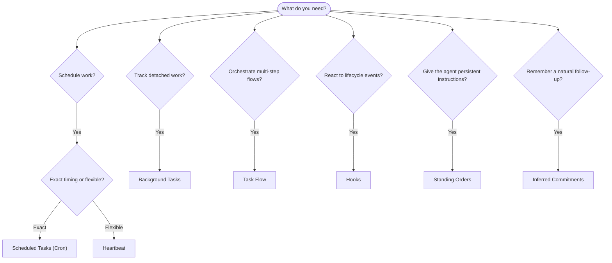

OpenClaw 通过任务、计划作业、推断在后台运行工作
承诺、事件挂钩和长期指示。此页面可帮助你选择
正确的机制并了解它们如何组合在一起。

## 快速决策指南

| 使用案例                      | 推荐            | 为什么                                          |
| ----------------------------- | --------------- | ----------------------------------------------- |
| 上午 9 点整发送每日报告       | 计划任务 (Cron) | 精确计时，隔离执行                              |
| 20 分钟后提醒我               | 计划任务 (Cron) | 精确计时的一次性 (`--at`)                       |
| 每周进行深度分析              | 计划任务 (Cron) | 独立任务，可以使用不同的模型                    |
| 每 30 分钟检查一次收件箱      | 心跳            | 具有其他检查的批次，上下文感知                  |
| 监控日历以了解即将发生的事件  | 心跳            | 自然适合周期性意识                              |
| 在提到的面试后签到            | 推断承诺        | 记忆式跟进，无确切提醒请求                      |
| 用户上下文后的温柔护理签入    | 推断承诺        | 范围为同一智能体商和渠道                        |
| 检查子智能体或 ACP 运行的状态 | 后台任务        | 任务分类账跟踪所有独立工作                      |
| 审计运行内容和时间            | 后台任务        | `openclaw tasks list` 和 `openclaw tasks audit` |
| 多步研究再总结                | Task Flow       | 具有修订跟踪功能的持久编排                      |
| 在会话重置时运行脚本          | 挂钩            | 事件驱动，触发生命周期事件                      |
| 在每个工具调用上执行代码      | Plugin 钩子     | 进程内钩子可以拦截工具调用                      |
| 回复前务必检查合规性          | 常规订单        | 自动注入每个会话                                |

### 计划任务 (Cron) 与 Heartbeat

| 尺寸       | 计划任务 (Cron)             | 心跳                       |
| ---------- | --------------------------- | -------------------------- |
| 时间       | 精确（cron 表达式，一次性） | 大约（默认每 30 分钟一次） |
| 会话上下文 | 新鲜（隔离）或共享          | 完整的主会议背景           |
| 任务记录   | 始终创造                    | 从未创建                   |
| 交货       | 通道、Webhook 或静默        | 内嵌在主会话中             |
| 最适合     | 报告、提醒、后台作业        | 收件箱检查、日历、通知     |

当你需要精确计时或独立执行时，请使用计划任务 (Cron)。当工作受益于完整的会话上下文并且大致时间合适时，请使用 Heartbeat。

## 核心概念

### 计划任务 (cron)

Cron 是 Gateway 的内置调度程序，用于精确计时。它保留作业，在正确的时间唤醒智能体，并可以将输出传递到聊天通道或 Webhook 端点。支持一次性提醒、重复表达式和入站 Webhook 触发器。

请参阅[计划任务](/automation/cron-jobs)。

### 任务

后台任务分类帐跟踪所有分离的工作：ACP 运行、子智能体生成、独立的 cron 执行和 CLI 操作。任务是记录，而不是调度程序。使用 `openclaw tasks list` 和 `openclaw tasks audit` 检查它们。

请参阅[后台任务](/automation/tasks)。

### 推断承诺

承诺是选择加入的、短暂的后续记忆。 OpenClaw 推断它们
从正常对话中，将其范围限定为相同的智能体和渠道，以及
通过心跳交付到期签到。仍然准确的用户请求的提醒
属于 cron。

请参阅[推断的承诺](/concepts/commitments)。

### Task Flow

Task Flow 是后台任务之上的流程编排底层。它通过托管和镜像同步模式、修订跟踪和用于检查的 `openclaw tasks flow list|show|cancel` 来管理持久的多步骤流程。

请参阅 [Task Flow](/automation/taskflow)。

### 常规命令

常规指令授予智能体人对指定项目的永久操作权。它们位于工作区文件（通常为 `AGENTS.md`）中，并被注入到每个会话中。与 cron 结合进行基于时间的执行。

请参阅[常规命令](/automation/standing-orders)。

### 挂钩

内部挂钩是由智能体生命周期事件触发的事件驱动脚本
(`/new`、`/reset`、`/stop`)、会话压缩、网关启动和消息
流动。它们会从目录中自动发现并可以进行管理
与 `openclaw hooks`。对于进程内工具调用拦截，请使用
[Plugin 挂钩](/plugins/hooks)。

请参阅[挂钩](/automation/hooks)。

### 心跳

心跳是周期性的主会话轮次（默认每 30 分钟一次）。它可以在一个智能体轮流中使用完整的会话上下文批量进行多项检查（收件箱、日历、通知）。心跳轮换不会创建任务记录，也不会延长每日/空闲会话重置的新鲜度。使用 `HEARTBEAT.md` 作为一个小检查表，或者当你希望在心跳本身内部进行定期检查时使用 `tasks:` 块。空心跳文件跳过为`empty-heartbeat-file`； due-only 任务模式跳过为 `no-tasks-due`。当 cron 工作处于活动状态或排队时，心跳会延迟，并且 `heartbeat.skipWhenBusy` 也可以在子智能体或嵌套通道繁忙时延迟心跳。

请参阅[心跳](/gateway/heartbeat)。

## 他们如何协同工作

- **Cron** 处理精确的时间表（每日报告、每周回顾）和一次性提醒。所有 cron 执行都会创建任务记录。
- **Heartbeat** 每 30 分钟批量处理日常监控（收件箱、日历、通知）。
- **Hooks** 使用自定义脚本对特定事件（会话重置、压缩、消息流）做出反应。 Plugin 挂钩覆盖工具调用。
- **常规命令**为智能体提供持久的上下文和权限边界。
- **Task Flow** 协调各个任务之上的多步骤流程。
- **任务**自动跟踪所有独立的工作，以便你可以检查和审核它。

＃＃ 有关的

- [计划任务](/automation/cron-jobs) — 精确调度和一次性提醒
- [推断的承诺](/concepts/commitments) — 类似记忆的后续签到
- [后台任务](/automation/tasks) — 所有独立工作的任务分类帐
- [Task Flow](/automation/taskflow) — 持久的多步骤流程编排
- [Hooks](/automation/hooks) — 事件驱动的生命周期脚本
- [Plugin 挂钩](/plugins/hooks) — 进程内工具、提示、消息和生命周期挂钩
- [常规命令](/automation/standing-orders) — 永久智能体指令
- [Heartbeat](/gateway/heartbeat) — 定期主会话轮流
- [配置参考](/gateway/configuration-reference) — 所有配置键
