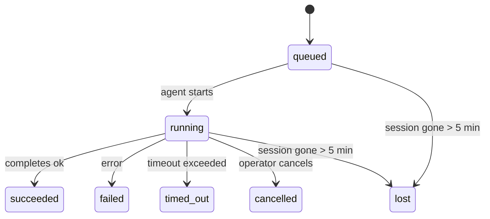

<Note>
寻找日程安排？请参阅[自动化和任务](/automation) 以选择正确的机制。此页面是后台工作的活动分类帐，而不是调度程序。
</Note>

后台任务跟踪在**主对话会话之外**运行的工作：ACP 运行、子智能体生成、独立的 cron 作业执行和 CLI 启动的操作。

任务不会取代会话、cron 作业或心跳——它们是记录独立工作发生的情况、时间以及是否成功的**活动分类帐**。

<Note>
并非每个智能体运行都会创建任务。心跳转和正常的互动聊天不会。所有 cron 执行、ACP 生成、子智能体生成和 CLI 智能体命令都会执行。
</Note>

## 长篇大论；博士

- 任务是**记录**，而不是调度程序 - cron 和心跳决定工作运行的时间，任务跟踪发生了什么。
- ACP、子智能体、所有 cron 作业和 CLI 操作创建任务。心跳轮流不。
- 每个任务都经过 `queued → running → terminal` （成功、失败、超时、取消或丢失）。
- 当 cron 运行时仍然拥有作业时，Cron 任务保持活动状态；如果
  内存中的运行时状态消失了，任务维护首先检查持久的cron
  在将任务标记为丢失之前运行历史记录。
- 完成是推送驱动的：分离的工作可以直接通知或唤醒
  请求者会话/心跳完成时，因此状态轮询循环是
  通常是错误的形状。
- 隔离的 cron 运行和子智能体完成在最终清理簿记之前尽力清理其子会话的跟踪浏览器选项卡/进程。
- 隔离的 cron 传递会抑制过时的临时父级回复，而后代子智能体的工作仍在耗尽，并且它更喜欢在传递之前到达的最终后代输出。
- 完成通知直接传送到通道或排队等待下一个心跳。
- `openclaw tasks list` 显示所有任务； `openclaw tasks audit` 表面问题。
- 终端记录保留7天，然后自动删除。

## 快速开始

<Tabs>
  <Tab title="List and filter">
    ```bash
    # List all tasks (newest first)
    openclaw tasks list

    # Filter by runtime or status
    openclaw tasks list --runtime acp
    openclaw tasks list --status running
    ```

  </Tab>
  <Tab title="Inspect">
    ```bash
    # Show details for a specific task (by ID, run ID, or session key)
    openclaw tasks show <lookup>
    ```
  </Tab>
  <Tab title="Cancel and notify">
    ```bash
    # Cancel a running task (kills the child session)
    openclaw tasks cancel <lookup>

    # Change notification policy for a task
    openclaw tasks notify <lookup> state_changes
    ```

  </Tab>
  <Tab title="Audit and maintenance">
    ```bash
    # Run a health audit
    openclaw tasks audit

    # Preview or apply maintenance
    openclaw tasks maintenance
    openclaw tasks maintenance --apply
    ```

  </Tab>
  <Tab title="Task flow">
    ```bash
    # Inspect TaskFlow state
    openclaw tasks flow list
    openclaw tasks flow show <lookup>
    openclaw tasks flow cancel <lookup>
    ```
  </Tab>
</Tabs>

## 什么创建了任务

| 来源                  | 运行时类型 | 任务记录何时创建                                  | 默认通知策略 |
| --------------------- | ---------- | ------------------------------------------------- | ------------ |
| ACP 后台运行          | `acp`      | 生成子 ACP 会话                                   | `done_only`  |
| 子智能体编排          | `subagent` | 通过 `sessions_spawn` 生成子智能体                | `done_only`  |
| Cron 作业（所有类型） | `cron`     | 每个 cron 执行（主会话和隔离）                    | `silent`     |
| CLI 操作              | `cli`      | `openclaw agent` 通过网关运行的命令               | `silent`     |
| 智能体媒体职位        | `cli`      | 会话支持的 `music_generate`/`video_generate` 运行 | `silent`     |

<AccordionGroup>
  <Accordion title="Notify defaults for cron and media">
    主会话 cron 任务默认使用 `silent` 通知策略 — 它们创建用于跟踪的记录，但不生成通知。独立的 cron 任务也默认为 `silent` 但更明显，因为它们在自己的会话中运行。

    会话支持的 `music_generate` 和 `video_generate` 运行也使用 `silent` 通知策略。他们仍然创建任务记录，但完成情况将作为内部唤醒交回原始智能体会话，以便智能体可以编写后续消息并附加完成的媒体本身。如果你选择 `tools.media.asyncCompletion.directSend`，异步 `video_generate` 完成可以首先尝试直接通道传递；异步 `music_generate` 完成保留在请求者会话唤醒路径上。

  </Accordion>
  <Accordion title="Concurrent video_generate guardrail">
    虽然会话支持的 `video_generate` 任务仍处于活动状态，但该工具还充当护栏：同一会话中重复的 `video_generate` 调用会返回活动任务状态，而不是启动第二个并发生成。当你希望从智能体端进行显式进度/状态查找时，请使用 `action: "status"` 。
  </Accordion>
  <Accordion title="What does not create tasks">
    - 心跳轮流——主会场；请参阅[心跳](/gateway/heartbeat)
    - 正常互动聊天轮流
    - 直接 `/command` 响应

  </Accordion>
</AccordionGroup>

## 任务生命周期



| 状态        | 这意味着什么                              |
| ----------- | ----------------------------------------- |
| `queued`    | `queued`已创建，等待智能体启动            |
| `running`   | 智能体轮正在积极执行                      |
| `succeeded` | 顺利完成                                  |
| `failed`    | 已完成但有错误                            |
| `timed_out` | 超过配置的超时时间                        |
| `cancelled` | 由操作员通过 `openclaw tasks cancel` 停止 |
| `lost`      | 5 分钟宽限期后，运行时失去权威支持状态    |

转换会自动发生 - 当关联的智能体运行结束时，任务状态会更新以匹配。

智能体运行完成对于活动任务记录具有权威性。成功的分离运行最终确定为 `succeeded`，普通运行错误最终确定为 `failed`，超时或中止结果最终确定为 `timed_out`。如果操作员已取消任务，或者运行时已记录更强的终端状态，例如 `failed`、`timed_out` 或 `lost`，则稍后的成功信号不会降级该终端状态。

`lost` 是运行时感知的：

- ACP 任务：支持 ACP 子会话元数据消失。
- 子智能体任务：支持子会话从目标智能体存储中消失。
- Cron 任务：cron 运行时不再将作业跟踪为活动且持久
  cron 运行历史记录不显示该运行的最终结果。离线CLI
  审计不会将其自己的空进程内 cron 运行时状态视为权限。
- CLI 任务：隔离的子会话任务使用子会话；聊天支持
  CLI 任务使用实时运行上下文，因此会出现延迟
  频道/组/直接会话行不会使它们保持活动状态。 Gateway-支持
  `openclaw agent` 运行也根据其运行结果完成，因此已完成运行
  在清扫机将其标记为 `lost` 之前，不要处于活动状态。

## 交付和通知

当任务达到最终状态时，OpenClaw 会通知你。有两种交付路径：

**直接传递** — 如果任务有通道目标 (`requesterOrigin`)，则完成消息将直接发送到该通道（Telegram、Discord、Slack 等）。对于子智能体完成，OpenClaw 还保留可用的绑定线程/主题路由，并且可以在放弃直接传递之前从请求者会话的存储路由 (`lastChannel` / `lastTo` / `lastAccountId`) 填充缺失的 `to` / 帐户。

**会话排队传递** — 如果直接传递失败或未设置源，则更新将作为请求者会话中的系统事件进行排队，并在下一个心跳时显示。

<Tip>
任务完成会立即触发心跳唤醒，因此你可以快速看到结果 - 无需等待下一个计划的心跳滴答声。
</Tip>

这意味着通常的工作流程是基于推送的：启动一次分离工作，然后让运行时唤醒或在完成时通知你。仅当你需要调试、干预或显式审核时才轮询任务状态。

### 通知政策

控制你对每项任务的了解程度：

| 政策                | 交付了什么                                   |
| ------------------- | -------------------------------------------- |
| `done_only`（默认） | 仅最终状态（成功、失败等）- **这是默认设置** |
| `state_changes`     | 每次状态转换和进度更新                       |
| `silent`            | 什么都没有                                   |

在任务运行时更改策略：

```bash
openclaw tasks notify <lookup> state_changes
```

## CLI 参考

<AccordionGroup>
  <Accordion title="tasks list">
    ```bash
    openclaw tasks list [--runtime <acp|subagent|cron|cli>] [--status <status>] [--json]
    ```

    输出列：任务 ID、种类、状态、交付、运行 ID、子会话、摘要。

  </Accordion>
  <Accordion title="tasks show">
    ```bash
    openclaw tasks show <lookup>
    ```

    查找token接受任务 ID、运行 ID 或会话密钥。显示完整记录，包括时间、交付状态、错误和终端摘要。

  </Accordion>
  <Accordion title="tasks cancel">
    ```bash
    openclaw tasks cancel <lookup>
    ```

    对于 ACP 和子智能体任务，这会终止子会话。对于 CLI 跟踪的任务，取消记录在任务注册表中（没有单独的子运行时句柄）。状态转换为 `cancelled` 并在适用时发送送达通知。

  </Accordion>
  <Accordion title="tasks notify">
    ```bash
    openclaw tasks notify <lookup> <done_only|state_changes|silent>
    ```
  </Accordion>
  <Accordion title="tasks audit">
    ```bash
    openclaw tasks audit [--json]
    ```

    暴露操作问题。当检测到问题时，调查结果也会显示在 `openclaw status` 中。

    |寻找|严重程度 |触发|
    | ---------------------------------- | ---------- | ------------------------------------------------------------------------------------------------------------------------ |
    | `stale_queued` |警告|排队10多分钟|
    | `stale_running` |错误 |跑步30分钟以上|
    | `lost` |警告/错误 |运行时支持的任务所有权消失了；保留丢失的任务警告直到 `cleanupAfter`，然后变成错误 |
    | `delivery_failed` |警告|传送失败且通知策略不是 `silent` |
    | `missing_cleanup` |警告|没有清理时间戳的终端任务 |
    | `inconsistent_timestamps` |警告|违反时间线（例如在开始之前结束）|

  </Accordion>
  <Accordion title="tasks maintenance">
    ```bash
    openclaw tasks maintenance [--json]
    openclaw tasks maintenance --apply [--json]
    ```

    使用它可以预览或应用任务和 Task Flow 状态的协调、清理标记和修剪。

    协调是运行时感知的：

    - ACP/subagent 任务检查其支持子会话。
    - 其子会话具有重新启动恢复逻辑删除的子智能体任务将被标记为丢失，而不是被视为可恢复的支持会话。
    - Cron 任务检查 cron 运行时是否仍然拥有该作业，然后从持久的 cron 运行日志/作业状态恢复终端状态，然后再回退到 `lost`。只有 Gateway 进程对内存中 cron 活动作业集具有权威性；离线 CLI 审计使用持久历史记录，但不会标记仅因为本地集为空而丢失的 cron 任务。
    - 聊天支持的 CLI 任务检查所属的实时运行上下文，而不仅仅是聊天会话行。

    完成清理也是运行时感知的：

    - 在宣布清理继续之前，子智能体完成会尽力关闭子会话的跟踪浏览器选项卡/进程。
    - 隔离的 cron 完成会在运行完全终止之前尽力关闭 cron 会话的跟踪浏览器选项卡/进程。
    - 独立的 cron 交付会在需要时等待后代子智能体跟进，并抑制过时的父确认文本而不是宣布它。
    - 子智能体完成交付更喜欢最新的可见辅助文本；如果它为空，它将回退到已清理的最新工具/工具结果文本，并且仅超时工具调用运行可以折叠为简短的部分进度摘要。终端运行失败会宣布失败状态，而不重播捕获的回复文本。
    - 清理失败不会掩盖真正的任务结果。

  </Accordion>
  <Accordion title="tasks flow list | show | cancel">
    ```bash
    openclaw tasks flow list [--status <status>] [--json]
    openclaw tasks flow show <lookup> [--json]
    openclaw tasks flow cancel <lookup>
    ```

    当你关心的是编排 Task Flow 而不是单个后台任务记录时，请使用这些。

  </Accordion>
</AccordionGroup>

## 聊天任务板 (`/tasks`)

在任何聊天会话中使用 `/tasks` 来查看链接到该会话的后台任务。该板显示活动的和最近完成的任务，包括运行时间、状态、计时以及进度或错误详细信息。

当当前会话没有可见的链接任务时，`/tasks` 会回退到智能体本地任务计数，因此你仍然可以获得概览，而不会泄漏其他会话详细信息。

对于完整的操作员分类帐，请使用 CLI：`openclaw tasks list`。

## 状态整合（任务压力）

`openclaw status` 包括概览任务摘要：

```
Tasks: 3 queued · 2 running · 1 issues
```

总结报告：

- **活动** — `queued` + `running` 的计数
- **失败** — `failed` + `timed_out` + `lost` 计数
- **按运行时** — 按 `acp`、`subagent`、`cron`、`cli` 细分

`/status` 和 `session_status` 工具都使用清理感知任务快照：首选活动任务，隐藏过时的已完成行，并且仅在没有活动工作剩余时才显示最近的故障。这使得状态卡专注于当前重要的事情。

## 储存与维护

### 任务所在的位置

任务记录保留在 SQLite 中：

```
$OPENCLAW_STATE_DIR/tasks/runs.sqlite
```

注册表在网关启动时加载到内存中，并将写入同步到 SQLite，以确保重新启动后的持久性。
Gateway 通过使用 SQLite 的默认值来保持 SQLite 预写日志的界限
自动检查点阈值加上定期和关闭 `TRUNCATE` 检查点。

### 自动维护

清扫机每 **60 秒**运行一次并处理四件事：

<Steps>
  <Step title="Reconciliation">
    检查活动任务是否仍然具有权威的运行时支持。 ACP/subagent 任务使用子会话状态，cron 任务使用活动作业所有权，聊天支持的 CLI 任务使用所属运行上下文。如果该支持状态消失超过 5 分钟，该任务将被标记为 `lost`。
  </Step>
  <Step title="ACP session repair">
    仅当不存在活动对话绑定时，才关闭终端或孤立的父级拥有的一次性 ACP 会话，并关闭过时的终端或孤立的持久 ACP 会话。
  </Step>
  <Step title="Cleanup stamping">
    在终端任务上设置 `cleanupAfter` 时间戳（endAt + 7 天）。保留期间，丢失的任务仍会在审核中显示为警告； `cleanupAfter` 过期后或清理元数据丢失时，它们是错误。
  </Step>
  <Step title="Pruning">
    删除 `cleanupAfter` 日期之后的记录。
  </Step>
</Steps>

<Note>
**保留：**终端任务记录保留**7天**，然后自动修剪。无需配置。
</Note>

## 任务如何与其他系统相关

<AccordionGroup>
  <Accordion title="Tasks and Task Flow">
    [Task Flow](/automation/taskflow) 是后台任务之上的流程编排层。单个流可以使用托管或镜像同步模式在其生命周期内协调多个任务。使用 `openclaw tasks` 检查各个任务记录，并使用 `openclaw tasks flow` 检查编排流程。

    有关详细信息，请参阅 [Task Flow](/automation/taskflow)。

  </Accordion>
  <Accordion title="Tasks and cron">
    cron 作业 **定义** 位于 `~/.openclaw/cron/jobs.json` 中；运行时执行状态位于 `~/.openclaw/cron/jobs-state.json` 中。 **每个** cron 执行都会创建一个任务记录 - 包括主会话和隔离任务记录。主会话 cron 任务默认采用 `silent` 通知策略，以便它们进行跟踪而不生成通知。

    请参阅 [Cron 作业](/automation/cron-jobs)。

  </Accordion>
  <Accordion title="Tasks and heartbeat">
    心跳运行是主会话轮流 - 它们不会创建任务记录。当任务完成时，它可以触发心跳唤醒，以便你立即看到结果。

    请参阅[心跳](/gateway/heartbeat)。

  </Accordion>
  <Accordion title="Tasks and sessions">
    任务可以引用 `childSessionKey` （工作运行的位置）和 `requesterSessionKey` （启动它的人）。会话是对话上下文；任务是最重要的活动跟踪。
  </Accordion>
  <Accordion title="Tasks and agent runs">
    任务的 `runId` 链接到执行该工作的智能体运行。智能体生命周期事件（开始、结束、错误）会自动更新任务状态 - 你无需手动管理生命周期。
  </Accordion>
</AccordionGroup>

## 相关

- [自动化和任务](/automation) — 所有自动化机制一目了然
- [CLI：任务](/cli/tasks) — CLI 命令参考
- [Heartbeat](/gateway/heartbeat) — 定期主会话轮流
- [计划任务](/automation/cron-jobs) — 安排后台工作
- [Task Flow](/automation/taskflow) — 任务之上的流程编排
