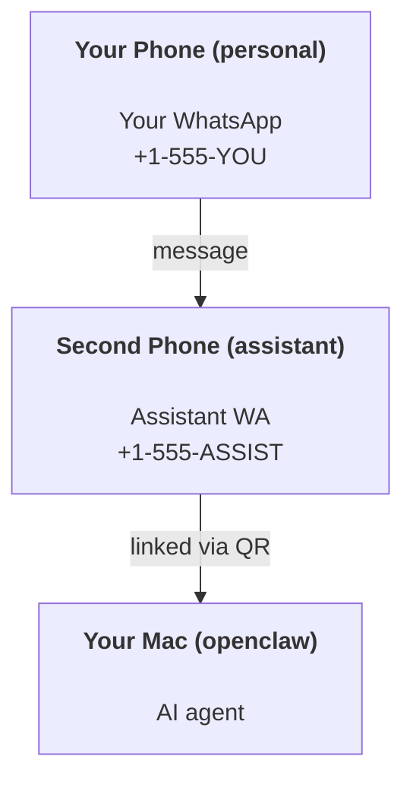

# 使用 OpenClaw 构建个人助理

OpenClaw 是一个自托管网关，连接 Discord、Google Chat、iMessage、Matrix、Microsoft Teams、 Signal、Slack、Telegram、WhatsApp、Zalo 等人工智能智能体。本指南介绍了“个人助理”设置：一个专用的 WhatsApp 号码，其行为就像你永远在线的人工智能助手一样。

## ⚠️ 安全第一

你让智能体人能够：

- 在你的计算机上运行命令（取决于你的工具策略）
- 读/写工作区中的文件
- 通过 WhatsApp/Telegram/Discord/Mattermost 和其他捆绑通道发送消息

开始保守：

- 始终设置 `channels.whatsapp.allowFrom` （切勿在你的个人 Mac 上运行 open-to-the-world）。
- 使用助理专用的 WhatsApp 号码。
- 心跳现在默认为每 30 分钟一次。禁用直到你通过设置 `agents.defaults.heartbeat.every: "0m"` 信任该设置。

## 先决条件

- OpenClaw 安装并加入 — 如果你尚未执行此操作，请参阅[入门](/start/getting-started)
- 助理的第二个电话号码 (SIM/eSIM/prepaid)

## 两部手机设置（推荐）

你想要这个：



如果你将你的个人 WhatsApp 链接到 OpenClaw，则发送给你的每条消息都将成为“智能体输入”。这很少是你想要的。

## 5 分钟快速启动

1. 配对WhatsApp Web（显示二维码；用助手手机扫描）：

```bash
openclaw channels login
```

2. 启动 Gateway（使其保持运行）：

```bash
openclaw gateway --port 18789
```

3. 将最小配置放入 `~/.openclaw/openclaw.json`：

```json5
{
  gateway: { mode: "local" },
  channels: { whatsapp: { allowFrom: ["+15555550123"] } },
}
```

现在，通过你列入许可名单的手机向助理号码发送消息。

入门完成后，OpenClaw 自动打开仪表板并打印干净的（非标记化）链接。如果仪表板提示进行认证，请将配置的共享密钥粘贴到 Control UI 设置中。默认情况下，入职使用token (`gateway.auth.token`)，但如果你将 `gateway.auth.mode` 切换为 `password`，密码认证也可以工作。稍后重新打开：`openclaw dashboard`。

## 给智能体一个工作区 (AGENTS)

OpenClaw 从其工作区目录中读取操作指令和“内存”。

默认情况下，OpenClaw 使用 `~/.openclaw/workspace` 作为智能体工作区，并将创建它（加上启动器 `AGENTS.md`、`SOUL.md`、`TOOLS.md`、`IDENTITY.md`、 `USER.md`、`HEARTBEAT.md`) 在安装/第一次智能体运行时自动运行。仅当工作区是全新的时才会创建 `BOOTSTRAP.md` （删除它后不应再回来）。 `MEMORY.md` 是可选的（不是自动创建的）；如果存在，则会为正常会话加载它。子智能体会话仅注入 `AGENTS.md` 和 `TOOLS.md`。

<Tip>
将此文件夹视为 OpenClaw 的内存，并将其设为 git 存储库（最好是私有的），以便备份你的 `AGENTS.md` 和内存文件。如果安装了 git，则会自动初始化全新的工作区。
</Tip>

```bash
openclaw setup
```

完整工作区布局+备份指南：[智能体工作区](/concepts/agent-workspace)
内存工作流程：[内存](/concepts/memory)

可选：使用 `agents.defaults.workspace` 选择不同的工作区（支持 `~`）。

```json5
{
  agents: {
    defaults: {
      workspace: "~/.openclaw/workspace",
    },
  },
}
```

如果你已经从存储库发送了自己的工作区文件，则可以完全禁用引导文件创建：

```json5
{
  agents: {
    defaults: {
      skipBootstrap: true,
    },
  },
}
```

## 将其变成“助手”的配置

OpenClaw 默认为良好的助手设置，但你通常需要调整：

- [`SOUL.md`](/concepts/soul) 中的角色/说明
- 思维默认值（如果需要）
- 心跳（一旦你信任它）

示例：

```json5
{
  logging: { level: "info" },
  agent: {
    model: "anthropic/claude-opus-4-6",
    workspace: "~/.openclaw/workspace",
    thinkingDefault: "high",
    timeoutSeconds: 1800,
    // Start with 0; enable later.
    heartbeat: { every: "0m" },
  },
  channels: {
    whatsapp: {
      allowFrom: ["+15555550123"],
      groups: {
        "*": { requireMention: true },
      },
    },
  },
  routing: {
    groupChat: {
      mentionPatterns: ["@openclaw", "openclaw"],
    },
  },
  session: {
    scope: "per-sender",
    resetTriggers: ["/new", "/reset"],
    reset: {
      mode: "daily",
      atHour: 4,
      idleMinutes: 10080,
    },
  },
}
```

## 会话和内存

- 会话文件：`~/.openclaw/agents/<agentId>/sessions/{{SessionId}}.jsonl`
- 会话元数据（token使用、最后路由等）：`~/.openclaw/agents/<agentId>/sessions/sessions.json`（旧版：`~/.openclaw/sessions/sessions.json`）
- `/new` 或 `/reset` 为该聊天启动一个新会话（可通过 `resetTriggers` 配置）。如果单独发送，OpenClaw 会在不调用模型的情况下确认重置。
- `/compact [instructions]` 压缩会话上下文并报告剩余的上下文预算。

## 心跳（主动模式）

默认情况下，OpenClaw 每 30 分钟运行一次心跳，并提示：
`Read HEARTBEAT.md if it exists (workspace context). Follow it strictly. Do not infer or repeat old tasks from prior chats. If nothing needs attention, reply HEARTBEAT_OK.`
将 `agents.defaults.heartbeat.every: "0m"` 设置为禁用。

- 如果 `HEARTBEAT.md` 存在但实际上是空的（只有空行和像 `# Heading` 这样的 Markdown 标头），OpenClaw 会跳过心跳运行以保存 API 调用。
- 如果文件丢失，心跳仍然运行，模型决定做什么。
- 如果智能体使用 `HEARTBEAT_OK` 进行回复（可选地使用短填充；请参阅 `agents.defaults.heartbeat.ackMaxChars`），则 OpenClaw 会抑制该检测信号的出站传送。
- 默认情况下，允许向 DM 样式 `user:<id>` 目标传送心跳。设置 `agents.defaults.heartbeat.directPolicy: "block"` 以抑制直接目标传递，同时保持心跳运行活动。
- 心跳运行完整的智能体轮流 - 较短的间隔会燃烧更多的token。

```json5
{
  agent: {
    heartbeat: { every: "30m" },
  },
}
```

## 媒体输入和输出

入站附件（图像/音频/文档）可以通过模板显示在你的命令中：

- `{{MediaPath}}`（本地临时文件路径）
- `{{MediaUrl}}`（伪URL）
- `{{Transcript}}`（如果启用了音频转录）

来自智能体的出站附件：在其自己的行上包含 `MEDIA:<path-or-url>`（无空格）。例子：

```
Here’s the screenshot.
MEDIA:https://example.com/screenshot.png
```

OpenClaw 提取这些内容并将它们作为媒体与文本一起发送。

本地路径行为遵循与智能体相同的文件读取信任模型：

- 如果 `tools.fs.workspaceOnly` 是 `true`，则出站 `MEDIA:` 本地路径仍限制为 OpenClaw 临时根、媒体缓存、智能体工作区路径和沙箱生成的文件。
- 如果 `tools.fs.workspaceOnly` 是 `false`，则出站 `MEDIA:` 可以使用已允许智能体读取的主机本地文件。
- 主机本地发送仍然只允许媒体和安全文档类型（图像、音频、视频、PDF 和 Office 文档）。纯文本和类似机密的文件不被视为可发送的媒体。

这意味着当你的 fs 策略已经允许读取时，工作区外部生成的图像/文件现在可以发送，而无需重新打开任意主机文本附件渗透。

## 操作清单

```bash
openclaw status          # local status (creds, sessions, queued events)
openclaw status --all    # full diagnosis (read-only, pasteable)
openclaw status --deep   # asks the gateway for a live health probe with channel probes when supported
openclaw health --json   # gateway health snapshot (WS; default can return a fresh cached snapshot)
```

日志位于 `/tmp/openclaw/` 下（默认值：`openclaw-YYYY-MM-DD.log`）。

## 后续步骤

- WebChat: [WebChat](/web/webchat)
- Gateway 操作：[Gateway 运行手册](/gateway)
- Cron + 唤醒：[Cron 作业](/automation/cron-jobs)
- macOS 菜单栏同伴：[OpenClaw macOS 应用](/platforms/macos)
- iOS 节点应用：[iOS 应用](/platforms/ios)
- Android 节点应用：[Android 应用](/platforms/android)
- Windows 状态：[Windows (WSL2)](/platforms/windows)
- Linux 状态：[Linux 应用](/platforms/linux)
- 安全：[安全](/gateway/security)

## 相关

- [入门](/start/getting-started)
- [设置](/start/setup)
- [频道概述](/channels)
