# OpenClaw 核心链路学习指南

> **目标读者**：纯 Java 后端开发者
> **目的**：从消息入口到 LLM 响应，逐层理解 OpenClaw 源码

---

## 学习路线说明

### 阅读本文档前必读

#### 一个现实问题：看懂 vs 掌握

| 层级 | 含义 | 需要多久 | 能做什么 |
|------|------|---------|---------|
| **看懂** | 跟着链路读明白每行代码在做什么 | 约 2 周 | 能描述流程，能回答原理问题 |
| **掌握** | 能改、能扩展、能排查 bug、能基于它开发新功能 | 3~6 个月+持续实践 | 能写新插件、接新模型、修核心 bug |

> 光看懂不等于掌握，差距很大。看懂是指能跟着链路读明白每行代码在做什么。掌握是指能改它、能扩展它、能排查它的bug、能基于它开发新功能。

#### 怎么学最有效

**不要**把这份路径当课程大纲从头到尾死读。

更有效的方式是**带着一个具体任务去读**，比如：

> "我想接入一个新的 LLM（比如通义千问），需要改哪些文件？"

这样读代码会快 10 倍，因为你有目的，看到无关的跳过，看到关键的自然就记住了。

#### 三个学习层次决定你的目标

| 你的目标 | 学习方式 | 时间预估 |
|---------|----------|---------|
| 看懂项目干了什么 | 按本指南从头到尾跟一遍链路 | 1-2 周 |
| 能在上面开发新插件/接新模型 | 跟着本指南看懂链路后，直接动手写代码 | 2-4 周 |
| 深度掌握整个架构 | 看完链路后，改核心链路、跑测试、踩坑 | 3 个月以上持续实践 |

> 先想清楚你要哪个层次，再决定怎么学。

---

## 一、宏观架构图

```
                    +-------------------------------------------+
                    |            Channel Plugin                  |
                    |  (Telegram / Discord / WebChat / etc.)     |
                    |  约等于 Java Controller @RequestMapping    |
                    +-------------------+-----------------------+
                                        |  收到消息
                                        v
                    +-------------------------------------------+
                    |         server-channels.ts                 |
                    |    createChannelManager()                  |
                    |  约等于 ChannelManager Bean (管理所有渠道) |
                    +-------------------+-----------------------+
                                        |  路由消息
                                        v
                    +-------------------------------------------+
                    |         server-chat.ts                     |
                    |    createAgentEventHandler()               |
                    |  约等于 AOP 切面 (处理 Agent 事件流)       |
                    +-------------------+-----------------------+
                                        |  触发自动回复
                                        v
                    +-------------------------------------------+
                    |  auto-reply/reply/get-reply.ts             |
                    |    getReplyFromConfig()                    |
                    |  约等于 @Service 核心业务编排方法          |
                    +-------------------+-----------------------+
                                        |  准备就绪后执行
                                        v
                    +-------------------------------------------+
                    |  auto-reply/reply/get-reply-run.ts         |
                    |    runPreparedReply()                      |
                    |  约等于 执行业务流程 (事务性)              |
                    +-------------------+-----------------------+
                                        |  调用 LLM
                                        v
                    +-------------------------------------------+
                    |  agents/agent-command.ts                   |
                    |    agentCommand() / agentCommandInternal() |
                    |  约等于 FeignClient 封装                   |
                    +-------------------+-----------------------+
                                        |  构建 HTTP 请求
                                        v
                    +-------------------------------------------+
                    |  agents/anthropic-transport-stream.ts      |
                    |  createAnthropicMessagesTransportStreamFn()|
                    |  约等于 @RequestBody 构建器                |
                    +-------------------+-----------------------+
                                        |  发送请求
                                        v
                    +-------------------------------------------+
                    |  gateway/openai-http.ts                    |
                    |  handleOpenAiHttpRequest()                 |
                    |  约等于 RestTemplate 最终 HTTP 调用        |
                    +-------------------------------------------+
```

---

## 二、逐层详解

---

### 第 1 层：Channel Plugin（渠道插件层）

**对应 Java**：`@Controller` / `@RequestMapping`，接收外部请求

**关键文件**：每个渠道插件在 `extensions/` 下，例如：
- `extensions/telegram/` — Telegram Bot
- `extensions/discord/` — Discord Bot
- `extensions/whatsapp/` — WhatsApp

**核心逻辑**（伪代码）：
```
channel.on('message', (msg) => {
  // 1. 解析消息格式为统一结构
  const ctx = createMsgContext({
    text: msg.text,
    userId: msg.from.id,
    chatId: msg.chat.id,
    media: msg.photo,  // 如有图片
  });
  // 2. 将统一结构传给网关
  gateway.handleIncomingMessage(ctx);
});
```

**关键理解**：
- 每个 Channel Plugin 是一个**适配器（Adapter）**，将不同平台的消息格式**统一化**
- 统一的格式叫 `MsgContext`（消息上下文），包含：文本、发送者、会话标识、附件等
- 插件只做"接收 -> 统一 -> 转发"，不做业务逻辑

---

### 第 2 层：server-channels.ts（渠道管理器层）

**对应 Java**：`ChannelManager` 是一个管理所有渠道 Bean 生命周期和状态的 **Service**

**关键文件**：`src/gateway/server-channels.ts`

**关键方法**：

| 方法 | 类比 Java | 作用 |
|------|-----------|------|
| `createChannelManager()` | `new ChannelManager()` | 创建渠道管理器，类似 Spring 容器的初始化 |
| `startChannels()` | `@PostConstruct` | 启动所有已配置的渠道（相当于开启各平台的监听） |
| `stopChannels()` | `@PreDestroy` | 优雅关闭所有渠道连接 |

**核心理解**：
```typescript
// createChannelManager() 返回一个对象，包含以下关键能力：
const channelManager = {
  getRuntimeSnapshot,  // 当前渠道运行时快照（运行状态）
  startChannels,       // 启动所有渠道（遍历配置，逐个 new 插件实例）
  stopChannels,        // 停止所有渠道（断开连接）
  restartChannel,      // 重启单个渠道（错误恢复）
};
```

**Java 等价理解**：
```java
public class ChannelManager {
    private Map<String, ChannelPlugin> channels = new HashMap<>();

    @PostConstruct
    public void startChannels() {
        // 读取配置，遍历初始化每个渠道
    }

    public void handleMessage(Message msg) {
        // 路由消息到合适的 handler
    }
}
```

---

### 第 3 层：server-chat.ts（聊天事件处理层）

**对应 Java**：**AOP 切面** + **事件监听器**，负责处理 Agent 执行过程中的事件流

**关键文件**：`src/gateway/server-chat.ts`

**关键方法**：

| 方法 | 类比 Java | 作用 |
|------|-----------|------|
| `createAgentEventHandler()` | `@EventListener` | 创建 Agent 事件处理器，监听文本输出、工具调用等事件 |
| `resolveHeartbeatAckMaxChars()` | 配置工具方法 | 解析心跳确认消息的最大字符数 |

**核心理解**：
- Agent 执行 LLM 时会不断产生事件（streaming 文本块、工具调用开始/结束、错误等）
- `createAgentEventHandler()` 创建的回调函数会：
  1. 接收 Agent 的 streaming 文本块
  2. 实时推送给前端（Control UI / WebChat）
  3. 处理 `[DONE]` 信号标记回复完成

**Java 等价理解**：
```java
// 类似于 WebSocket 的 streaming 推送
public class AgentEventHandler {
    @EventListener
    public void onAssistantText(AssistantTextEvent event) {
        // 每收到一个文本块，就推送给前端
        webSocket.send(event.getText());
    }

    @EventListener
    public void onToolCall(ToolCallEvent event) {
        // 工具调用事件
    }
}
```

---

### 第 4 层：getReplyFromConfig（自动回复编排层 - 核心）

**对应 Java**：`@Service` 中的**核心编排方法**，包含完整的业务流程

**关键文件**：`src/auto-reply/reply/get-reply.ts`，方法在第 175 行

**关键方法**：

```
getReplyFromConfig(ctx, opts, configOverride)
+-- 解析 Agent 配置 (agentId, skills, model, provider)
+-- 初始化 Workspace (读取 AGENTS.md, SOUL.md 等引导文件)
+-- 处理入站媒体 (图片/音频 -> 描述文本)
+-- 初始化 Session (读取历史消息)
+-- 执行命令检测 (如果是 /command 则直接执行)
+-- 调用 runPreparedReply() -> 真正执行 Agent
```

**参数说明（类比 Java）**：

| 参数 | 类型 | 类比 Java | 含义 |
|------|------|-----------|------|
| `ctx` | `MsgContext` | `HttpServletRequest` | 消息上下文：文本、发送者、渠道、附件 |
| `opts` | `GetReplyOptions` | `@RequestParam` Map | 可选项：心跳标记、超时、技能过滤 |
| `configOverride` | `OpenClawConfig` | 临时配置覆盖 | 测试时用的配置覆盖 |

**方法内关键步骤**：
```typescript
export async function getReplyFromConfig(ctx, opts, configOverride) {
  // 步骤 1：解析运行配置
  const cfg = resolveGetReplyConfig({...});

  // 步骤 2：确定用哪个 Agent（agentId）
  const agentId = resolveSessionAgentId({ sessionKey, config: cfg });

  // 步骤 3：确定用哪个模型
  const { defaultProvider, defaultModel } = resolveDefaultModel({ cfg, agentId });

  // 步骤 4：初始化工作区（读取 AGENTS.md 等）
  const workspace = await ensureAgentWorkspace({ dir: workspaceDir });

  // 步骤 5：处理入站媒体（图片/音频/视频 -> 文本描述）
  await applyMediaUnderstandingIfNeeded({ ctx, cfg, activeModel });

  // 步骤 6：初始化 Session（加载历史消息）
  const session = await initSessionState({ ctx, cfg, sessionKey });

  // 步骤 7：执行 runPreparedReply() -> 调用 LLM
  return await runPreparedReply({ ctx, session, cfg, modelState, ... });
}
```

---

### 第 5 层：runPreparedReply（回复执行层）

**对应 Java**：执行业务流程，类似 `@Transactional` 方法，保证一次回复的完整生命周期

**关键文件**：`src/auto-reply/reply/get-reply-run.ts`，方法在第 347 行

**方法签名**：
```typescript
export async function runPreparedReply(
  params: RunPreparedReplyParams,
): Promise<ReplyPayload | ReplyPayload[] | undefined>
```

**核心职责**：
1. 构建**系统提示（System Prompt）** -- 把 AGENTS.md、SOUL.md、TOOLS.md 等注入到 prompt 中
2. 构建**用户消息** -- 把当前用户输入拼接好
3. 调用 `agentCommand()` -> 发送给 LLM
4. 处理 LLM 返回的 streaming 响应
5. 解析 `NO_REPLY`、`MEDIA:` 等特殊指令
6. 返回 `ReplyPayload`（最终回复内容）

**返回类型 `ReplyPayload` 的定义（类比 Java DTO）**：
```typescript
type ReplyPayload = {
  text?: string;       // 回复文本
  mediaUrl?: string;   // 可选的媒体附件 URL
  mediaUrls?: string[]; // 多个媒体附件
};
```

**如果返回 `undefined`**：表示不回复（NO_REPLY）

---

### 第 6 层：agentCommand（Agent 调度层 - 核心）

**对应 Java**：`FeignClient` 封装层，负责调用远程 LLM API

**关键文件**：`src/agents/agent-command.ts`

**两个入口方法**：

| 方法 | 用途 | 信任级别 |
|------|------|---------|
| `agentCommand()` 第 1228 行 | CLI/本地调用 | senderIsOwner = true（完全信任） |
| `agentCommandFromIngress()` 第 1251 行 | 网络入站（HTTP/WS） | 必须显式声明 senderIsOwner |

**核心内部方法 `agentCommandInternal()`（第 425 行）** 的工作流：
```
agentCommandInternal()
+-- resolveAgentCommandDeps()      // 初始化依赖
+-- prepareAgentCommandExecution()  // 准备执行上下文
|   +-- resolve Session
|   +-- build prompt body
|   +-- normalize model/provider
|
+-- resolveSendPolicy()            // 检查能否发送（类似权限检查）
|
+-- 选择执行路径：
|   +-- ACP 路径 (acpResolution.kind === "ready")
|   |   -> 使用外部 ACP agent 执行
|   |
|   +-- 原生路径
|       -> 构建 transport stream -> 调用 LLM
|
+-- 处理响应，返回结果
```

**关键设计模式**：
- **策略模式**：根据配置选择 ACP 路径还是原生路径
- **模板方法**：`agentCommandInternal` 定义了执行骨架，子流程可替换

---

### 第 7 层：Transport Stream（传输流层）

**对应 Java**：`@RequestBody` 构建器 + 响应解析器

**关键文件**：`src/agents/anthropic-transport-stream.ts`

**关键方法**（第 858 行）：
```typescript
export function createAnthropicMessagesTransportStreamFn(): StreamFn {
  return (rawModel, context, rawOptions) => {
    // 1. 构建 API 请求体（system prompt + messages + tools）
    // 2. 调用 HTTP 客户端发送请求
    // 3. 处理 streaming 响应，逐块解析
    // 4. 按 OpenAI/Anthropic SSE 协议解析事件
  };
}
```

**核心工作**：
```typescript
// 构建的 API 请求体大致结构：
{
  model: "deepseek/deepseek-v4-flash",
  messages: [
    { role: "system", content: "..." },   // 系统提示（包含 skills 配置）
    { role: "user", content: "..." },      // 用户消息
    { role: "assistant", content: "..." }, // 历史助手回复
  ],
  tools: [ /* 工具定义 */ ],               // 有哪些工具可用
  stream: true,                            // 使用 streaming
}
```

---

### 第 8 层：openai-http.ts（HTTP 网关入口）

**对应 Java**：`RestTemplate.exchange()` / `WebClient` 发起 HTTP 请求

**关键文件**：`src/gateway/openai-http.ts`

**关键方法**（第 517 行）：
```typescript
export async function handleOpenAiHttpRequest(
  req: IncomingMessage,   // HTTP 请求
  res: ServerResponse,    // HTTP 响应
): Promise<void>
```

**核心职责**：
1. 接收来自各种渠道和 Control UI 的请求
2. 转发到对应的 LLM Provider API
3. 处理认证、限流、超时
4. 返回 streaming 或非 streaming 响应

---

## 三、流程图：一条消息的完整旅程

```mermaid
flowchart TB
    subgraph P1["阶段一：消息入站 (类似 Spring 的 Filter -> Controller)"]
        A1["Telegram Bot 收到消息"]
        A2["extensions/telegram/index.ts
            消息适配器：解析 Telegram Update -> MsgContext"]
        A3["server-channels.ts
            startChannels() 注册的 channel
            收到 MsgContext"]
        A4["server-chat.ts
            createAgentEventHandler()
            建立事件监听管道"]
    end

    subgraph P2["阶段二：自动回复编排 (类似 @Service 核心方法)"]
        B1["getReplyFromConfig()
            1. 解析 agentId、model、provider"]
        B2["2. ensureAgentWorkspace()
            读取 AGENTS.md/SOUL.md/TOOLS.md"]
        B3["3. initSessionState()
            加载/创建 session，读取历史"]
        B4["4. applyMediaUnderstanding()
            如果有图片 -> 转写描述"]
        B5["5. runPreparedReply()
            执行准备"]
    end

    subgraph P3["阶段三：Agent 执行 LLM 调用 (类似 FeignClient + RestTemplate)"]
        C1["runPreparedReply()
            构建 System Prompt (技能文件注入)"]
        C2["agentCommand()
            选择执行路径"]
        C3["agentCommandInternal()
            核心调度"]
        C4["createAnthropicMessages-
            TransportStreamFn()
            构建 API 请求体"]
        C5["handleOpenAiHttpRequest()
            发送 HTTP POST 到 DeepSeek API"]
        C6["LLM Provider
            (api.deepseek.com)"]
    end

    subgraph P4["阶段四：流式响应处理 (类似 WebSocket 推送)"]
        D1["SSE streaming 逐块返回"]
        D2["createAgentEventHandler()
            每收到一个文本块 -> 推送给 WebChat"]
        D3["runPreparedReply()
            收集完整响应"]
        D4["解析 NO_REPLY / MEDIA: 指令"]
        D5["返回 ReplyPayload -> Channel Plugin"]
        D6["用户看到回复"]
    end

    A1 --> A2 --> A3 --> A4 --> B1
    B1 --> B2 --> B3 --> B4 --> B5
    B5 --> C1 --> C2 --> C3 --> C4 --> C5 --> C6
    C6 -->|SSE streaming| D1 --> D2 --> D3 --> D4 --> D5 --> D6
```



---

## 四、验收标准

每看完一层后，用以下问题自测是否真的理解了。

### 第 1 层验收（Channel Plugin）

| 验收问题 | 答案提示 |
|---------|---------|
| 如果要新增一个渠道（如飞书），需要在哪个目录新建插件？ | extensions/feishu/ |
| Channel Plugin 的核心职责是什么？ | 适配器模式：将平台消息统一为 MsgContext |
| 渠道插件里做业务逻辑（如天气查询）是对的吗？ | 不对，插件只做消息格式转换，业务逻辑在 auto-reply 层 |
| 实操验证：找到 extensions/deepseek/openclaw.plugin.json，看 input 字段声明了什么？ | ["text"] -- 证明只支持文本输入 |

### 第 2 层验收（server-channels.ts）

| 验收问题 | 答案提示 |
|---------|---------|
| createChannelManager() 返回的对象类型叫什么？ | ChannelManager |
| ChannelManager 的哪个方法负责启动所有 Channel？ | startChannels() |
| 重启单个 Channel 用哪个方法？ | restartChannel() |
| ChannelManager 如何追踪渠道的运行状态？ | 通过 channelStores: Map |

### 第 3 层验收（server-chat.ts）

| 验收问题 | 答案提示 |
|---------|---------|
| createAgentEventHandler() 的作用是什么？ | 创建 Agent 事件处理器，监听 streaming 文本块等事件，实时推送给前端 |
| Agent 执行过程中产生的 streaming 文本块通过什么机制推送到前端？ | 事件广播（broadcast）-> 前端 WebSocket |
| 实操验证：在 server-chat.ts 中找到 resolveHeartbeatAckMaxChars 函数，它依赖什么配置？ | agents.defaults.heartbeat.ackMaxChars |

### 第 4 层验收（get-reply.ts）

| 验收问题 | 答案提示 |
|---------|---------|
| getReplyFromConfig 的第一个参数 ctx 的类型是什么？ | MsgContext |
| 该函数执行过程中，哪一步负责读取 AGENTS.md 到工作区？ | ensureAgentWorkspace() |
| 如果有图片消息进来，哪一步负责处理图片理解？ | applyMediaUnderstandingIfNeeded() |
| 实操验证：手动给 getReplyFromConfig 加上 console.log 断点，然后发送一条消息，观察调用栈 | 见下方实操说明 |
| 动手题：描述从收到你好到返回回复的完整调用链（说清楚调用了哪些文件） | 参考流程图 |

### 第 5 层验收（get-reply-run.ts）

| 验收问题 | 答案提示 |
|---------|---------|
| runPreparedReply() 返回什么类型？ | Promise<ReplyPayload | ReplyPayload[] | undefined> |
| ReplyPayload 包含哪些字段？ | { text?, mediaUrl?, mediaUrls? } |
| 什么情况下返回 undefined？ | 检测到 NO_REPLY 指令时 |
| 实操验证：找到代码中处理 [DONE] 信号的地方，理解它代表什么 | streaming 结束信号 |
| 动手题：如果你希望回复中添加一张图片，流程中哪些文件需要变更？ | get-reply-run.ts 中解析 MEDIA: 指令的位置 |

### 第 6 层验收（agent-command.ts）

| 验收问题 | 答案提示 |
|---------|---------|
| agentCommand() 和 agentCommandFromIngress() 有什么区别？ | 前者默认 senderIsOwner=true（信任），后者需要显式声明 |
| agentCommandInternal() 选择执行路径时，有哪两种路径？ | ACP 路径（外部 agent）和原生路径（直接调 LLM） |
| prepareAgentCommandExecution() 做了哪些准备？ | 解析 session、构建 body、标准化 model/provider |
| 实操验证：给 agentCommandInternal 入口加分治法日志，观察一次对话的调用时序 | |

### 第 7 层验收（Transport Stream）

| 验收问题 | 答案提示 |
|---------|---------|
| 该层构建的 API 请求体包含哪几部分？ | system prompt、messages history、tools definition、stream flag |
| 为什么叫 transport stream？ | 因为它是 LLM 到 Agent 之间的数据传输流，处理 SSE 协议 |
| 实操验证：在 createAnthropicMessagesTransportStreamFn 中打印构建好的请求体，观察一次完整的请求 | |

### 第 8 层验收（openai-http.ts）

| 验收问题 | 答案提示 |
|---------|---------|
| handleOpenAiHttpRequest 的 req 和 res 是什么类型？ | Node.js IncomingMessage 和 ServerResponse |
| 该文件除了转发请求外，还处理什么？ | 认证、限流、超时 |
| 高级题：如果要换 LLM Provider（比如从 DeepSeek 换成 OpenAI），需要改哪些地方？ | 主要是 extensions/ 下的 provider 插件配置，openai-http.ts 是通用层 |

---

## 五、综合验收

以下才是你真的掌握了这个项目的标志：

### 基础级：填空

你能不看源码，手写出以下调用链：

```
用户发消息 ->
[  ] 层: _____________________
[  ] 层: _____________________
[  ] 层: _____________________
[  ] 层: _____________________
[  ] 层: _____________________
[  ] 层: _____________________
[  ] 层: _____________________
-> 用户看到回复
```

答案就在第一章流程图中。

### 进阶级：场景题

**场景 1：WebChat 发一条消息没收到回复，怎么排查？**

排查路径：
1. 先看 Channel Plugin 有没有收到消息 -> 看 server-channels.ts 的日志
2. 再看 getReplyFromConfig 有没有被调用
3. 再看 agentCommand 有没有调 LLM
4. 最后看 runPreparedReply 返回了什么

**场景 2：要加一个用户权限检查拦截器，加在哪一层最合适？**

答：getReplyFromConfig() 或 agentCommandInternal() 的入口处，类似 Spring 的 HandlerInterceptor

**场景 3：LLM 返回了 NO_REPLY，回复是从哪一层被截断的？**

答：runPreparedReply() -> get-reply-run.ts 中解析响应时检测到 NO_REPLY token，返回 undefined

**场景 4：接入一个新的 LLM Provider（如通义千问），需要改哪些文件？**

答：
1. 在 extensions/ 下建新 provider 插件（如 extensions/qianwen/）
2. 插件中实现 StreamFn（参考 extensions/deepseek/ 的实现）
3. 在 openclaw.json 中配置新的 provider
4. 可以不动核心链路（agent-command.ts / get-reply.ts 等），因为 provider 是插件化设计的

### 项目级：动手验证清单

- [ ] 在 getReplyFromConfig 里加上 console.log，在 WebChat 发消息看到日志
- [ ] 说出当前 DeepSeek V4 Flash 的 API 调用链中，每一步的文件名和行号范围
- [ ] 如果要加一个消息审核功能（回复前先过审核 API），知道在哪一层加
- [ ] 能画出一张完整的类图，展示各层之间的依赖关系
- [ ] 能在 extensions/ 下新建一个最简单的 provider 插件并成功调用

---

## 六、如何用 vs 如何读

### 两种阅读方式

| 方式 | 适合场景 | 做法 |
|------|---------|------|
| 纵向阅读 | 第一遍建立整体认知 | 按本文档顺序，从第 1 层跟到第 8 层 |
| 横向阅读 | 带着具体任务时 | 关注任务涉及的层，跳过无关的 |

### 推荐学习节奏

| 时间 | 做什么 | 成果 |
|------|-------|------|
| 第 1 天 | 通读本文档，建立整体认知 | 能画出 8 层架构图 |
| 第 2-3 天 | 纵向跟代码：第 1-3 层 | 理解消息入站 |
| 第 4-6 天 | 纵向跟代码：第 4-5 层 | 理解自动回复编排 |
| 第 7-9 天 | 纵向跟代码：第 6-8 层 | 理解 LLM 调用 |
| 第 10-14 天 | 横向：带着具体任务读（比如接一个新模型） | 能改代码 |

---

## 七、调试技巧

```bash
# 1. 加追踪日志
# 在 get-reply.ts 第 175 行（getReplyFromConfig 入口）加：
console.log("[Trace] getReplyFromConfig 被调用", ctx.Text);

# 在 agent-command.ts 第 1228 行（agentCommand 入口）加：
console.log("[Trace] agentCommand 被调用", opts.sessionKey, opts.model);

# 2. 启动开发模式
cd E:\project\AI\openclaw
pnpm gateway:dev

# 3. 用测试用例验证链路
pnpm vitest run src/auto-reply/reply/ --reporter verbose
```

---

## 八、对照速查表

| Java 概念 | OpenClaw 对应 | 文件:行号 |
|-----------|--------------|----------|
| @Controller / @RequestMapping | Channel Plugin | extensions/*/index.ts |
| ChannelManager (管理所有渠道) | createChannelManager() | src/gateway/server-channels.ts:199 |
| @EventListener (事件监听) | createAgentEventHandler() | src/gateway/server-chat.ts:157 |
| @Service 核心编排方法 | getReplyFromConfig() | src/auto-reply/reply/get-reply.ts:175 |
| @Transactional 事务方法 | runPreparedReply() | src/auto-reply/reply/get-reply-run.ts:347 |
| FeignClient 远程调用封装 | agentCommand() / agentCommandInternal() | src/agents/agent-command.ts:1228 / :425 |
| @RequestBody 构建器 | createAnthropicMessagesTransportStreamFn() | src/agents/anthropic-transport-stream.ts:858 |
| RestTemplate.exchange() | handleOpenAiHttpRequest() | src/gateway/openai-http.ts:517 |
| HttpServletRequest | MsgContext | src/auto-reply/types.ts |
| @Configuration | OpenClawConfig | src/config/config.ts |
| @Value 配置注入 | getRuntimeConfig() | src/config/io.ts |
| DTO | ReplyPayload | src/auto-reply/reply-payload.ts |

---

> 下一步建议：打开 VS Code，从 `src/auto-reply/reply/get-reply.ts` 第 175 行的 `getReplyFromConfig` 开始，一行一行读，有问题随时问我。
>
> 记住：**带着任务读代码，比从头到尾死读快 10 倍。**
